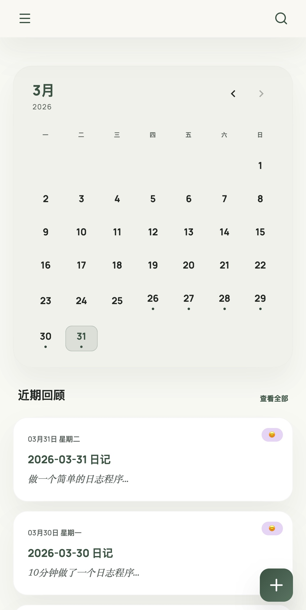

# 自建私有日记本：MyDiary —— 属于你的 NAS 极简写作空间

在这个数据隐私备受关注的时代，你是否还在寻找一个安全、私密、且完全由自己掌控的日记空间？

今天，我想向大家推荐一款我最近开发的开源项目：**MyDiary**。它专为追求极致隐私和简约体验的开发者、文字爱好者打造。

---

## 🌟 为什么选择 MyDiary？

市面上的日记 App 很多，但要么因为“数据在云端”让人缺乏安全感，要么因为功能过于臃肿让人失去了写作的动力。

MyDiary 的核心逻辑非常纯粹：**数据主权归用户，写作过程无压力。**

### 1. 私有化部署（NAS 友好）
支持 Docker 一键部署，非常适合运行在你的 Synology（群晖）、QNAP（威联通）或者自己的云服务器上。所有日记数据（包括图片）都存储在本地数据库中，真正做到“我的数据我做主”。

### 2. 极简主义设计
基于 **Vue 3 + Tailwind CSS** 构建，整体 UI 风格现代且沉静。没有社交干扰，没有广告植入，只有你和你的文字。

### 3. 日历式回顾
通过直观的日历视图，你可以清晰地观察到自己的写作频率。每一天的思绪，都被温柔地安放在日期方框里。

### 4. 沉浸式编辑器
支持 Markdown 语法，实时保存。配合图片上传功能，让你的日记不再只是干巴巴的文字，而是图文并茂的生活记录。

---

## 🛠️ 技术栈揭秘

作为一个开发者，我也在项目中实践了目前主流的全栈开发方案：

- **前端**：Vue 3 + TypeScript + Vite + Tailwind CSS
- **后端**：Node.js + Express + TypeScript
- **数据库**：PostgreSQL (关系型数据库，保证数据一致性)
- **部署**：Docker & Docker Compose

---

## 📸 预览

*(在此处插入你的项目截图)*




---

## 🚀 快速上手

只需三步，即可拥有属于自己的私有日记服务：

1. **环境配置**：配置 `.env` 文件。
2. **启动容器**：
   ```bash
   docker-compose up -d --build
   ```
3. **开始写作**：访问 `http://your-ip:3000` 即可开始记录。

---

## 🌈 未来计划

- [ ] 多端适配优化（移动端 PWA 支持）
- [ ] 导出功能（Markdown / PDF 格式）
- [ ] 更加丰富的统计图表（心情曲线、关键词云）

---

## 🔗 开源地址

如果你也喜欢这个项目，欢迎点个 **Star** 支持一下！

GitHub 仓库：[https://github.com/aladdin0414/mydiary](https://github.com/aladdin0414/mydiary)

期待在 Issue 区听到你的反馈和建议，让我们一起完善这个属于私人的角落。

---

> “日记是写给未来的自己的一封情书。” —— 愿 MyDiary 能帮你留住那些珍贵的瞬间。
